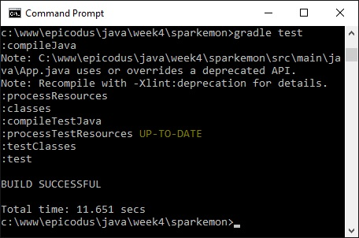
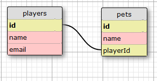

# Sparkemon
Version 0.0.0: September 24, 2016

by [Karen Freeman-Smith](https://github.com/karenfreemansmith)

## Description
Practice project for Epicodus - Java, week 4 lessons. Create a virtual pet program using Java, Spark, and PostgreSQL.

### Specifications
#### User Stories:
* As a player, I can have multiple pets

#### Database Diagram:

#### Technical Specifications:
| Behavior                               |             Input             |           Output           |
|----------------------------------------|:-----------------------------:|:--------------------------:|
| Can create players with name and email |   "Henry", "henry@henry.com"  | "Henry", "henry@henry.com" |
| Can create pets with name              |           "Bubbles"           |          "Bubbles"         |
| Can assign multiple pets to a player   | Henry + Bubbles, Henry + Spud |        Bubbles, Spud       |

## Setup/Installation
* Clone directory
* Setup database in PSQL:
  * CREATE DATABASE sparkemon;
  * \c sparkemon;
  * CREATE TABLE players (id serial PRIMARY KEY, name varchar, email varchar);
  * CREATE TABLE pets (id serial PRIMARY KEY, name varchar, playerId int);

* Type 'gradle run' inside the directory
* Navigate to 'http://localhost:4567'

## Support & Contact
For questions, concerns, or suggestions please email karenfreemansmith@gmail.com

## Known Issues
* N/A

## Technologies Used
Java, JUnit, Spark, PostgreSQL, Gradle

## Legal
*Licensed under the GNU General Public License v3.0*

Copyright (c) 2016 Copyright _Karen Freeman-Smith_ All Rights Reserved.
